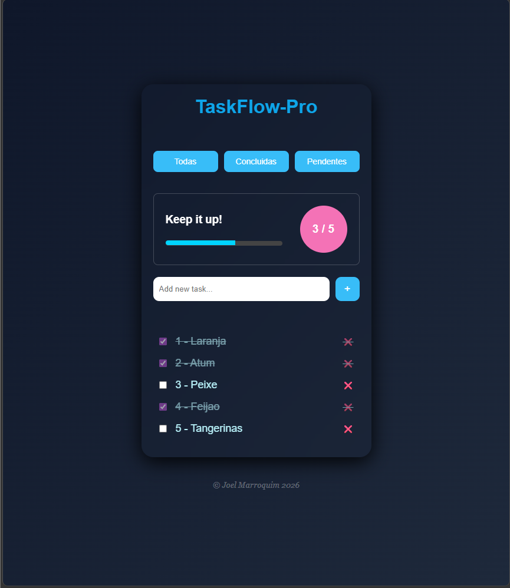

# 🚀 TaskFlow Pro

Aplicação de gestão de tarefas (To-Do List) moderna e interativa, desenvolvida com **HTML, CSS e JavaScript puro**, focada em lógica de programação, manipulação do DOM e experiência de utilizador.

---

## 📸 Preview

> Interface moderna com sistema de progresso, filtros dinâmicos e persistência de dados.

---

## ✨ Funcionalidades

* ✅ Adicionar tarefas dinamicamente
* ❌ Remover tarefas
* ☑ Marcar tarefas como concluídas
* 🔁 Atualização automática da interface (renderização)
* 🎯 Sistema de filtros:

  * Todas
  * Concluídas
  * Pendentes
* 📊 Sistema de progresso:

  * Contador de tarefas concluídas
  * Barra de progresso dinâmica
* 💾 Persistência com **localStorage**

  * Os dados permanecem mesmo após fechar o navegador

---

## 🧠 Conceitos aplicados

Este projeto foi desenvolvido com foco em consolidar fundamentos essenciais de JavaScript:

* Manipulação do DOM
* Eventos (`click`, `change`)
* Arrays e objetos
* Métodos de array:

  * `forEach`
  * `filter`
* Gestão de estado da aplicação
* Renderização dinâmica baseada em dados
* Persistência com `localStorage`
* Conversão de dados com `JSON.stringify` e `JSON.parse`
* Separação entre lógica e interface (UI)

---

## 🛠 Tecnologias utilizadas

* HTML5
* CSS3 (Flexbox, Grid, UI moderna)
* JavaScript (Vanilla JS)

---

## 📈 Evolução do projeto

O desenvolvimento foi feito de forma progressiva, simulando um cenário real de aprendizagem:

1. Estrutura base com HTML e CSS
2. Sistema de adicionar e remover tarefas
3. Introdução de objetos no array
4. Marcação de tarefas como concluídas
5. Implementação de filtros dinâmicos
6. Persistência com localStorage
7. Sistema de progresso (contador + barra)

---

## 🎯 Objetivo

Desenvolver uma aplicação prática para consolidar fundamentos de JavaScript e criar um projeto de portfólio com características reais de uma aplicação moderna.

---

### 🧪 Evolução
*(imagem da interface antes de adicionar produtos)*

*(imagem da lista com itens adicionados)*git add

## 🚀 Próximas melhorias

* ✏️ Editar tarefas
* 🌙 Dark / Light mode
* 🔎 Pesquisa de tarefas
* 📅 Datas e prioridades
* 📱 Melhor responsividade

---

## 👨‍💻 Autor

Desenvolvido por **Joel Marroquim**
📍 Em transição para desenvolvimento Full Stack

---

## 📌 Nota

Este projeto representa a evolução prática no estudo de JavaScript, com foco em construção de aplicações reais e preparação para frameworks como React.
